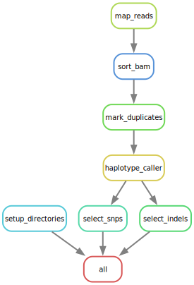

# SNV-GATK-Snakemake
This repository contains a Snakemake-based workflow designed as part of a project for the Computer and Software Architecture module in the Master’s in Data Science program.

## Project Background
This project implements a workflow for genomic data processing, specifically focusing on Single Nucleotide Variant (SNV) discovery. The workflow follows established best practices and guidelines to ensure scientific accuracy and reproducibility.

## Guidelines Followed

We designed and implemented the workflow by closely following the GATK Best Practices for Germline Short Variant Discovery, as described in the GATK official documentation and tutorials.

The GATK guideline provided step-by-step instructions for:
	1.	Pre-processing sequencing data:
	•	Marking duplicates, sorting BAM files, and recalibrating base quality scores.
	2.	Variant discovery:
	•	Employing the GVCF-based pipeline using HaplotypeCaller.
	3.	Variant filtering:
	•	Selecting and filtering SNPs and Indels for downstream analysis.

This guideline served as the foundation for building the Snakemake pipeline, ensuring our workflow adheres to the same standards recommended by experts in the field.
 
## Tool Versions
- Snakemake: v6.0+
- FastQC: v0.11.9
- BWA: v0.7.17
- SAMtools: v1.13
- GATK: v4.2.0.0
- Python: v3.8+
- Java: v1.8+

## Workflow for variant calling using GATK and Snakemake

### Data preparation: ​

- Setup: Creates necessary directories for storing output files.
    a configuration file that contains paths, input filenames and setting used withthis workflow
- fastqc: 
    runs quality control FASTQC over FASTQ files​  generate quality reports for raw FASTQ files.

(Daniela from here)

map_reads: maps reads to the reference genome using BWA​

sort_bam: sorts the unsorted BAM files using Samtools​

mark_duplicates: marks duplicate reads using GATK MarkDuplicates​

​
### Variant calling: ​

haplotype_caller: calls variants using GATK Haplotype caller, outputs GVCF files​

select_snps: extracts SNPs using GATK SelectVariants ​

select_indels: extracts indels using GATK SelectVariants ​

## Visual Overview

## Future Improvements
base recalibration
indexing of reference genome 