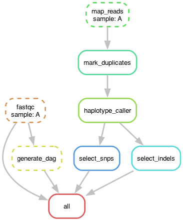

# SNV-GATK-Snakemake
This repository contains a Snakemake-based workflow designed as part of a project for the Computer and Software Architecture module in the Master’s in Data Science program at FHNW.

## Project Background
This project implements a workflow for genomic data processing, specifically focusing on Single Nucleotide Variant (SNV) discovery. The workflow follows established best practices and guidelines to ensure scientific accuracy and reproducibility.

## Guidelines Followed

We designed and implemented the workflow by closely following the GATK Best Practices for Germline Short Variant Discovery, as described in the GATK official documentation and tutorials.

The GATK guideline provided step-by-step instructions for:
1. Pre-processing sequencing data:
    -  Marking duplicates, sorting BAM files, and recalibrating base quality scores.
2. Variant discovery:
    - Employing the GVCF-based pipeline using HaplotypeCaller.
3. Variant filtering:
    - Selecting and filtering SNPs and Indels for downstream analysis.

This guideline served as the foundation for building the Snakemake pipeline, ensuring our workflow adheres to the same standards recommended by experts in the field.
 
## Tool Versions
- Snakemake: v6.0+
- FastQC: v0.11.9
- BWA: v0.7.17
- SAMtools: v1.13
- GATK: v4.2.0.0
- Python: v3.8+
- Java: v1.8+

## Workflow for variant calling using GATK and Snakemake (pipeline rules)

### Data preparation: ​

- setup_directories: Creates necessary directories for storing output files.
    A configuration file that contains paths, input filenames and setting used withthis workflow
- fastqc: 
    Runs quality control FASTQC over FASTQ files​  generate quality reports for raw FASTQ files.
-map_reads: 
    Aligns the raw sequencing reads to the reference genome using BWA, producing unsorted bam files for each sample. 
-sort_bam: 
    Sorts the bam files by genomic coordinates using Samtools. Prepares data for variant calling. 
-mark_duplicates: 
    Identifies and marks duplicate reads using GATK MarkDuplicates. 

​
### Variant calling: ​

-haplotype_caller: 
    Calls genetic variants for each sample using GATK HaplotypeCaller. Produces compressed GVCF files with raw variant data. 

-select_snps: 
    Extracts SNPs from the GVCF files using GATK SelectVariants. Produces compressed VCF files for each sample

-select_indels: 
    Same process for SNPS, but this extracts INDELs (insertions and deletions). Produces compressed VCF files for each sample.  ​
    

## Visual Overview
Visual overview of Pipeline processes on example sample A: 

## Future Improvements

-Reference genome indexing: 
   The reference genome used in this pipeline was already indexed; however, this might not always be the case and might become important if the pipeline is used with a non-referenced genome. To make the pipeline more reproducible, a rule to index the reference genome using 'bwa index' could be added. This would ensure compatibility with any genome that hasn’t been pre-indexed.

-Trimming:
    Trimming improves the quality of the reads, which leads to better mapping accuracy and downstream variant calling.

-Adjustment of base quality score recalibration:
    To reduce false positives caused by sequencing biases or errors, a rule to account for Base Quality Score Recalibration (BQSR) could be added. This would require using GATK's BaseRecalibrator and database of known variants for the given reference genome. Including this step would improve the accuracy of variant calling. 

-Variant annotation: 
    The pipeline could introduce additional tools (ex. SnpEff or VEP) to annonate the identified variants and report whether these are found in coding regions, are of snynonymous/non-synonymous types, and are potentially pathogenic or not. 

